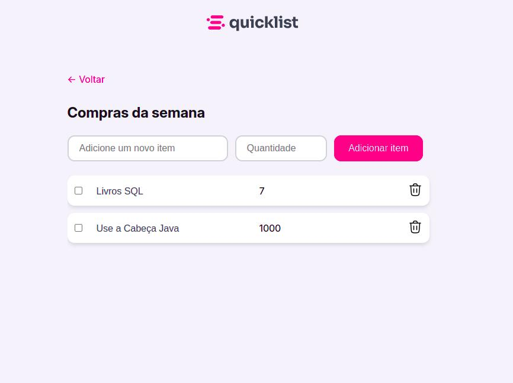

# 🛒 Lista de Compras 2.0 🛒

## Status do Projeto
🚧 Projeto em desenvolvimento. As principais funcionalidades ainda estão sendo implementadas.

  

 

## Índice
- [Descrição](#descrição)
- [Tecnologias](#tecnologias)
- [Funcionalidades](#funcionalidades)
- [Roadmap](#roadmap)
- [Rodando o Projeto](#rodando-o-projeto)

## Descrição
A Lista de Compras 2.0 é uma aplicação web para gerenciar uma lista de compras, utilizando uma arquitetura full stack. Esta versão oferece persistência de dados, integração de API, e um design otimizado para facilitar o gerenciamento das compras.

## Tecnologias
- **Back-end:** Java, Spring Boot
- **Banco de Dados:** H2 (em memória)
- **Front-end:** JavaScript, AngularJS
- **Gerenciamento de dependências:** Maven, npm

## Funcionalidades
- [x] Adicionar, editar e remover itens da lista de compras

## Roadmap
- [ ] Sincronização em tempo real entre front-end e back-end
- [ ] Banco de dados H2 em memória
- [ ] Implementar autenticação de usuário
- [ ] Criar interface para exportar a lista de compras como PDF
- [ ] Suporte para banco de dados persistente (PostgreSQL, MySQL)

## Rodando o projeto

### Back-end

Siga o caminho abaixo e execute a aplicação.  
backend/listaCompras/src/main/java/br/com/svaisser/listaCompras/ListaComprasApplication.java

#### Banco de dados Teste

http://localhost:8080/h2-console/  
Login: admin  
Password: admin  
O H2 é configurado em backend/listaCompras/src/main/resources/application.properties  

### Front-end

cd frontend 
npm install 
npm start 
